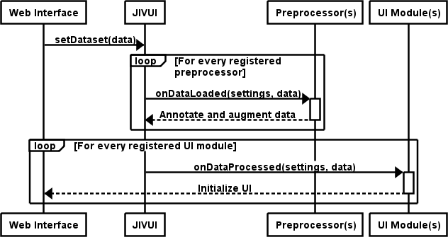
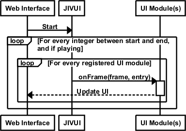

# JIVUI Plugin Architecture

JIVUI supports two types of plug-ins: *preprocessors* and *UI modules*. We designed the plug-in API so that a single component could serve as a preprocessor and a UI module in the interest of maximizing JIVUI's applicability to varied use cases.

Preprocessors are exclusively invoked on data load and their main task is to augment the data by performing calculations on it. For example, a preprocessor can be used on gaze data to determine fixations, or work with mouse motion and click data to add attributes that indicate when the mouse motion is occurring within the context of a drag operation. UI modules are responsible for rendering elements on the Web page and providing functionality to the end user. They are initialized on data load, and are invoked by JIVUI during playback. Examples of UI modules are a replay area to visually reproduce keystrokes and mouse motion, playback controls, and timelines.

## On Data Load

 When a new dataset is loaded, JIVUI invokes every preprocessor by calling their `onDataLoaded(settings, data)` method, providing the dataset's `settings` and `data` objects as arguments. This tells every preprocessor that a new dataset has been loaded and allows them augment data entries. After the dataset has been augmented, JIVUI notifies each UI module by calling their `onDataProcessed(settings, data)` method. A sequence diagram of this flow is shown below.

 

## On Playback

JIVUI invokes the `onFrame(frame, entry)` method on each UI module for every millisecond of the replay. The `frame` argument indicates the current millisecond being visualized, and the `entry` argument is an object containing the events that occurred in that millisecond, as described in [JIVUI's JSON Data Description](input_data_description.md). A sequence diagram of the playback flow is shown below.




## Structure of a Plug-in

Each plug-in lives in its own folder. This folder should contain a JSON file descriptor named `jivuiplugin.json`. This description contains a lists of all the resources that the plug-in depends on, such as JavaScript files, HTML templates, and/or CSS files. As follows:

```JavaScript
{
 "apiversion": "1",
 "type": ...,
 "src": ...,
 "template": ...,
 "style": ...
}
```

Only the `type` and `apiversion` attributes are requried.

  * `apiversion`: in case the API changes on future versions, this field identifies that API that a plug-in works with. This is intended to improve backward compatibility of future versions.
  * `type`: indicates, as a string, the type of plug-in. Possible values are `ui` for UI modules, `preprocessor` for preprocessors, and `both` in case a plug-in should serve as both a preprocessor and a UI module.
  * `src`: this can be either a string or an array of strings referencing the JavaScript files that this plug-in should load. Paths are relative to the root folder of the plug-in, but can also contain full URLS (`http://` and `https://`).
  * `template`: UI Modules can contain an HTML template. This template will be loaded in the place where the plug-in was referenced. Templates can include other plug-in dependencies, which will be loaded recursively.
  * `style`: this can be either a string or an array of strings referencing CSS files that this plug-in should load. Paths are relative to the root folder of the plug-in, but can also contain full URLS (`http://` and `https://`).


## Loading a Plug-in

Plug-ins are loaded through markup on HTML templates by annotating an HTML tab in the `body` of the template with the `data-jivui` attribute. The value of this attribute should be the path to the **folder** of a plug-in (not a particular file) and should be relative to the template. See the example below.

```html
  <div data-jivui="./plugins/timeline"></div>
```

In this example, a plug-in residing in the `plugins/template` folder relative to where this HTML file is stored will be loaded. JIVUI will automatically read this plug-in's `jivuiplugin.json` and load the resources it describes.

---

# Included Plug-ins

In order to make JIVUI usable out of the box, and to showcase its potential, we include with it a set of plug-ins that are suitable for the most common user interaction cases. We include basic preprocessors for gaze, keyboard, and mouse data, as well as a cognitive preprocessor. For UI modules, we include a replay region, a set of animation controls, and a timeline.


## Preprocessor Modules

### Gaze Preprocessors:  
 Two gaze preprocessors are included. One determines fixations using an implementation of the I-DT algorithm. For every gaze event, it adds a boolean attribute `fixated`. The second one uses an implementation of the 1€ filter to stabilize noisy gaze data, adding numeric `filteredX` and `filteredY` attributes with smoothed eye position values.

### Mouse Preprocessor:  
 The included mouse preprocessor augments mouse motion data by adding a boolean `dragged` attribute to every mouse motion event. When a mouse motion event occurs within the duration window of a click, as specified by the click's `duration` attribute, this value is set to true; otherwise it is set to false.

### Keyboard Preprocessor:  
 The keyboard preprocessor augments keystroke events by adding the number of milliseconds elapsed between the start of the current keystroke and the end of the previous one, as well as between the start of the current keystroke and the start of the previous one.

### Cognitive Preprocessor:  
 This preprocessor annotates keystroke data with cognitive and perceptual operators based on the Model Human Processor (MHP) and the TYPIST model. For every keystroke, this preprocessor creates a cognitive operator that precedes it, lasting 50ms. Similarly, before the first cognitive operator of every word, this preprocessor includes another cognitive operator that also lasts 50ms. Also for every word, a 340ms perceptual operator is created. The TYPIST model describes a working memory capacity of three words, thus perceptual operators for three words are created by this preprocessor at the beginning of the timeline; it waits for the typing of the first word to be completed before creating the perceptual operator for the next word, and so on.

## UI Modules

### Replay Region:  
 This UI module instantiates a text area where keystrokes appear as key events are received. It also loads two additional UI modules: one to overlay gaze data and the other to overlay mouse motion and clicks. The gaze and mouse UI modules consist of a `canvas` element each, and render gaze and mouse motion as moving dots overlaid on the interface. Click events appear as two concentric circles. To improve visibility, the eye and mouse indicators are rendered in different colors that contrast with the background, and are configured to leave a "trail" that fades away as the animation progresses.

### Animation Controls:  
This UI module is used to manipulate the animation. It provides controls to move the animation forward or backward to any particular frame, buttons to start, stop and pause the animation, and controls to set the animation's speed. As the animation is played, this plug-in updates the current millisecond being visualized to reflect the current frame in the animation. It also provides two keyboard shortcuts to control the animation: pressing the space bar will play and pause the animation, while pressing the backspace key will stop it.

### Timeline:  
 The included timeline plug-in is designed to look for the augmented data provided by the preprocessors described above and displays events and operators in five different tracks: gaze, mouse, keyboard, cognitive, and perceptual. Events on each track are displayed as boxes with their length based on the event's duration, and can sometimes overlap. The gaze track displays fixations, the mouse track displays clicks, and the keyboard track displays keystrokes. The cognitive and perceptual tracks display their corresponding operators. Each element on the timeline displays a tooltip on mouse hover providing more information about the event, such as the millisecond value when it occurred, its duration, and other corresponding data (\eg, position of a click, key pressed on a keystroke, etc.), as well as annotations provided by preprocessors, such as the time elapsed after the previous event of the same type.
